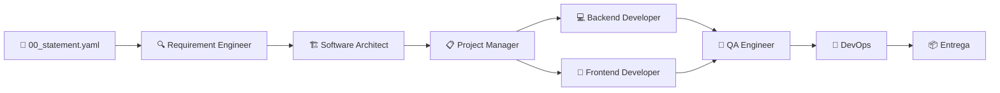

# 🎯 Spectrum SDD


**Spec-Driven Development Template Pack**

Desenvolvimento determinístico guiado por especificações com uma cadeia de agentes autônomos.

---

## O problema que estamos resolvendo

A maioria dos fluxos com IA hoje é **heurística e estocástica**: você joga um prompt e torce para o resultado ser bom.  

Spectrum SDD propõe o oposto: transformar o ciclo completo de desenvolvimento em um **processo determinístico, rastreável e governado por especificações rigorosas**.

### Antes vs Depois

| ❌ Vibe Coding | ✅ Spectrum SDD |
|----------------|-----------------|
| "Faz um sistema de tarefas com IA" | `00_statement.yaml` estruturado |
| 3+ iterações de "não era isso" | 7 agentes com papéis claros |
| Código sem rastreabilidade | Requisito → Código → Teste |
| Decisões implícitas | ADRs documentados |

---

## Como funciona

Spectrum organiza o ciclo de desenvolvimento em **4 macro-fases** com **7 agentes especializados**:



| # | Agente | Responsabilidade |
|---|--------|------------------|
| 1 | **Requirement Engineer** | Extrai e formaliza FRs, NFRs e modelo de domínio |
| 2 | **Software Architect** | Define bounded contexts, arquitetura, stack e ADRs |
| 3 | **Project Manager** | Quebra em tarefas, prioriza e cria backlog |
| 4 | **Backend Developer** | Implementa a camada de backend |
| 5 | **Frontend Developer** | Implementa a camada de frontend |
| 6 | **QA Engineer** | Cria planos de teste e critérios de aceitação |
| 7 | **DevOps** | Define pipeline, CI/CD e estratégias de deploy |

Cada agente:
- Recebe artefatos da fase anterior (YAML)
- Segue um template com `identity`, `role`, `inputs`, `outputs`, `steps` e `exit_criteria`
- Produz novos artefatos + um **relatório em Markdown** legível para humanos

O resultado é uma cadeia **rastreável, consistente e com muito menos alucinações**.

---

## Princípios do Spectrum

> 1. **Especificação > Prompt** — Documentos estruturados vencem prompts ad-hoc
> 2. **Rastreabilidade total** — De requisito até commit
> 3. **Agentes especializados** — Um papel, uma responsabilidade
> 4. **Humano no loop** — Relatórios legíveis para revisão
> 5. **Zero lock-in** — YAML + Markdown = portabilidade total

---

## Principais características

- Totalmente baseado em arquivos (YAML + Markdown) → sem lock-in
- Templates editáveis e extensíveis
- Separação clara entre especificação (máquina) e relatório (humano)
- Suporte a múltiplos bounded contexts
- Traceabilidade completa (do statement inicial até o código)
- Foco em qualidade arquitetural, NFRs e decisões explícitas
- Leve e pronto para usar com qualquer orquestrador

---

## Estrutura do projeto

```
spec/
├── agents/                    # Configuração de cada agente
├── templates/                 # Templates base (requisitos, backlog, etc.)
├── domains/                   # Artefatos por bounded context
├── drafts/                    # Rascunhos intermediários (auto-cleanup)
├── questions/                 # Perguntas abertas por agente
├── reports/                   # Relatórios legíveis em Markdown
└── 00_statement.yaml          # 🎯 Ponto de entrada do projeto
```

---

## Quick Start

```bash
# 1. Clone o repositório
git clone https://github.com/BriannOliveira/spectrum.git

# 2. Copie a pasta spec/ para seu projeto
cp -r spectrum/spec ./meu-projeto/

# 3. Edite o statement inicial
vim spec/00_statement.yaml

# 4. Execute com seu agente favorito (ex: Cursor, Claude)
# → Referencie o agente: @spec/agents/requirement_engineer.yaml
# → O agente lê o statement e produz os artefatos automaticamente

# 5. Revise os relatórios gerados
cat spec/reports/*.md
```

---

## Exemplo completo

📁 [`spec/00_statement_example.yaml`](./spec/00_statement_example.yaml)

> Um demo de como preencher a declaração do problema para construir um **Assistente Inteligente de Lista de Tarefas** em vez de um prompt escrito de qualquer jeito.

---

## Por que Spectrum é diferente?

- Não é mais um "prompt bonitinho". É uma **ontologia de desenvolvimento**.
- Substitui heurística por governança determinística.
- Foi feito por um desenvolvedor para desenvolvedores — prático, não acadêmico.
- Intencionalmente leve: você pode (e deve) modificar tudo.

---

## Visão de futuro

Spectrum não pretende ser o framework definitivo. Ele é uma **base genética aberta**.

A ideia é que pessoas e equipes usem esses templates como ponto de partida para criar suas próprias evoluções — seja com agentes mais avançados, integração com ferramentas específicas, validação automática de schemas, ou até novas fases do ciclo.

Se você criar algo interessante em cima dele, abra um PR ou me marque. Quero ver onde isso vai chegar.

---

## Contribuição

Contribuições são muito bem-vindas!

- Melhorias nos templates
- Novos agentes
- Exemplos reais
- Ferramentas de validação
- Documentação

Veja o [CONTRIBUTING.md](./CONTRIBUTING.md) para mais detalhes.

---

**Feito com foco em qualidade e determinismo.**

Se você também acredita que o futuro do desenvolvimento com IA passa por **especificações rigorosas + agentes especializados**, dê uma estrela ⭐ e compartilhe.

Vamos construir o próximo nível juntos.

---

**Autor:** Briann Oliveira  
**Licença:** MIT