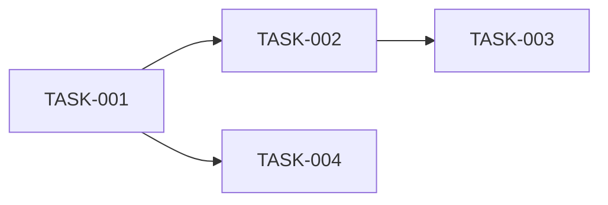

# Reporte de Gerenciamento de Projeto

## Identificacao
- Role: `project_manager`
- Contexto: <CTX-XXX>
- Periodo/Execucao: <data ou janela>
- Report ID: <NN_project_manager_report>
- Referencias: <spec/functional_requirements.yaml, spec/domain_model.yaml>

---

## Resumo Executivo
- **Objetivo**: <O que foi planejado/organizado>
- **Status**: <concluido|parcial|bloqueado>
- **Impacto**: <Prontidão para implementação>

---

## Estratégia de Implementação

### Visão Geral
> <Resumo da abordagem de implementação: fases, prioridades, e critérios de sucesso.>

### Fases de Entrega
| Fase | Objetivo | Critério de Sucesso | Dependências |
|------|----------|---------------------|--------------|
| 1 - Setup | <Infraestrutura base, CI/CD> | <Pipeline funcional> | <Nenhuma> |
| 2 - Core | <Funcionalidades must-have> | <FRs críticos implementados> | <Fase 1> |
| 3 - Polish | <Funcionalidades should-have> | <UX melhorada> | <Fase 2> |

### Alocação por Papel
| Papel | Fase(s) | Responsabilidades Principais |
|-------|---------|------------------------------|
| Backend Developer | <1, 2> | <Domain logic, APIs, integrations> |
| Frontend Developer | <2, 3> | <UI skeleton, integration wiring> |
| QA Engineer | <2, 3> | <Test matrix, quality gates> |
| DevOps | <1, 2> | <CI/CD, infra, observability> |

---

## User Stories → Tarefas

### Mapeamento de Derivação

#### US-001: <Título da User Story>
> **Como** <persona>, **quero** <ação>, **para que** <benefício>.

| Task ID | Título | Tipo | Owner | Prioridade | Trace |
|---------|--------|------|-------|------------|-------|
| TASK-001 | <título da tarefa> | <setup\|core\|support> | <backend\|frontend\|qa\|devops> | <P0\|P1\|P2> | FR-XXX |
| TASK-002 | <título da tarefa> | <...> | <...> | <...> | FR-XXX |

**Acceptance Criteria (US-001):**
- [ ] <Critério 1>
- [ ] <Critério 2>

---

#### US-002: <Título da User Story>
> **Como** <persona>, **quero** <ação>, **para que** <benefício>.

| Task ID | Título | Tipo | Owner | Prioridade | Trace |
|---------|--------|------|-------|------------|-------|
| TASK-003 | <título da tarefa> | <...> | <...> | <...> | FR-YYY |

**Acceptance Criteria (US-002):**
- [ ] <Critério 1>

---

## Backlog Consolidado

### Resumo por Prioridade
| Prioridade | Total de Tarefas | Estimativa (story points) |
|------------|------------------|---------------------------|
| P0 (Crítico) | <N> | <X> |
| P1 (Alto) | <N> | <X> |
| P2 (Médio) | <N> | <X> |
| P3 (Baixo) | <N> | <X> |

### Resumo por Tipo
| Tipo | Total | Descrição |
|------|-------|-----------|
| Setup | <N> | <Infraestrutura, configuração> |
| Core | <N> | <Funcionalidades de negócio> |
| Support | <N> | <Documentação, refatoração> |
| Spike | <N> | <Investigação técnica> |

### Dependências Críticas

---

## Spikes e Incertezas

| Spike ID | Pergunta a Responder | Output Esperado | Owner | Prazo |
|----------|---------------------|-----------------|-------|-------|
| SPIKE-001 | <Qual tecnologia de cache usar?> | <ADR + PoC> | <architect> | <data> |

---

## Riscos do Plano

| Risco | Impacto | Probabilidade | Mitigação |
|-------|---------|---------------|-----------|
| <Dependência de API externa instável> | <alto> | <média> | <Mock para testes, circuit breaker> |
| <Escopo pode crescer> | <médio> | <alta> | <Scope freeze após fase 1> |

---

## Métricas de Acompanhamento

| Métrica | Target | Como Medir |
|---------|--------|------------|
| Velocity | <X pontos/sprint> | <Burndown chart> |
| Lead Time | <Y dias> | <Criação → Deploy> |
| Bloqueios | <0 por semana> | <Tracking diário> |

---

## Decisões de Planejamento

| Decisão | Contexto | Alternativas | Racional |
|---------|----------|--------------|----------|
| <Sprint de 1 semana> | <Velocidade de feedback> | <2 semanas, kanban> | <Projeto pequeno, iteração rápida> |

---

## Handoff Recomendado
- **Próximo Agente**: <backend_developer|frontend_developer|devops>
- **Condição de Pronto**:
  - [ ] Tarefas da Fase 1 com acceptance criteria definidos
  - [ ] Dependências mapeadas
  - [ ] Spikes críticos resolvidos ou em andamento
  - [ ] Backlog priorizado e rastreável
- **Contexto/Observações**: <riscos, dependências, pontos de atenção>

---

## Anexos
- **Artefatos Atualizados**:
  - [spec/backlog.yaml](file://spec/backlog.yaml)
  - [spec/domains/<context>/tasks.yaml](file://spec/domains/<context>/tasks.yaml)
  - [spec/domains/<context>/implementation_strategy.yaml](file://spec/domains/<context>/implementation_strategy.yaml)
- **Diagramas**: <Gantt, dependency graph, etc.>
